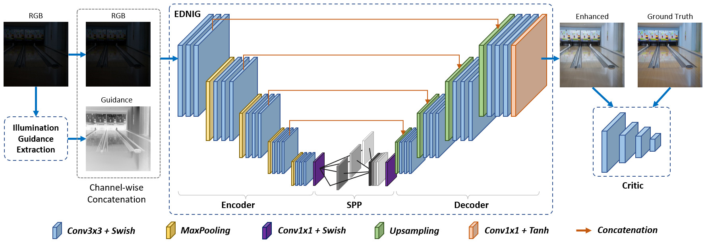

# EDNIG: Encoder-Decoder Network with Illumination Guidance for Low-Light Image Enhancement

[](https://arxiv.org/abs/2507.13360)
[](https://huggingface.co/tranleanh/ednig)

This is the implementation of the paper "Low-Light Enhancement via Encoder-Decoder Network with Illumination Guidance".

## Introduction
### Framework Diagram

<p align="center">

</p>

## Visual Examples

<p align="center">

</p>

<p align="center">

</p>

## Dependencies
Main dependencies (or equivalent):

- CUDA 10.0
- CUDNN 7.6
- OpenCV
- Tensorflow 1.14.0
- Keras 2.1.3

For other packages, simply run:
```bashrc
$ pip install -r requirements.txt
```

## Test
Download the pre-trained weights and modify the [weight_path](https://github.com/tranleanh/ednig/blob/c80d8eb769397c69deae19114b9d9ceefd12a642/test_on_images.py#L59) and [data folder](https://github.com/tranleanh/ednig/blob/c80d8eb769397c69deae19114b9d9ceefd12a642/test_on_images.py#L70C5-L70C12) for quick test.
```bashrc
$ python test_on_images.py
```


## Train
Refer to this [section](https://github.com/tranleanh/edn-gtm?tab=readme-ov-file#train) for training.
```bashrc
$ python train.py
```

## Citation
```bibtex
@article{tran2025low,
  title={Low-Light Enhancement via Encoder-Decoder Network with Illumination Guidance},
  author={Tran, Le-Anh and Tran, Chung Nguyen and Nguyen, Ngoc-Luu and Dang, Nhan Cach and Carrabina, Jordi and Castells-Rufas, David and Nguyen, Minh Son},
  journal={arXiv preprint arXiv:2507.13360},
  year={2025}
}
```

Have fun!

LA Tran
